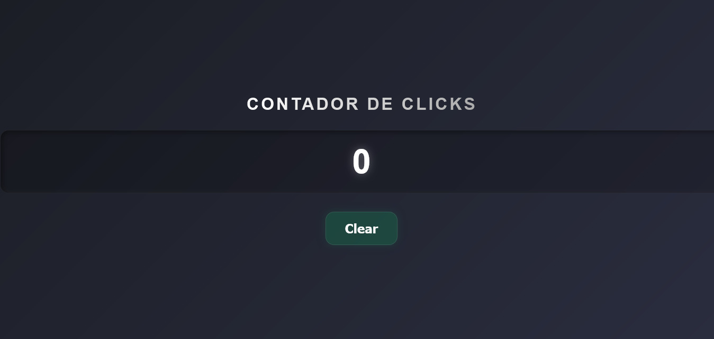

# 🖱️ Clicker Global - Contador Simples e Tátil


## 💻 Sobre o Projeto

Este é um projeto minimalista e divertido desenvolvido para atuar como um **Clicker de Tela Cheia**. A ideia é simples: **cada clique em qualquer lugar da área de visualização (viewport) aumenta o contador em uma unidade.**

Construído com **JavaScript Puro** para manipular o DOM, o projeto utiliza a estética **Glassmorphism** e um tema escuro moderno, proporcionando uma experiência de usuário limpa e tátil.



---

## ⚙️ Funcionalidades

- **Incremento Global:** Aumenta a contagem em 1 a cada clique na tela.
- **Visual Moderno:** Interface com efeito de vidro fosco (Glassmorphism) e design responsivo.
- **Reset por Teclado:** Zere o contador a qualquer momento pressionando a tecla **R** (de Reset) no seu teclado.
- **Contagem Ilimitada:** Perfeito para medir cliques rápidos ou outras interações.

---

## 🎨 Design e Estilo

O projeto utiliza as seguintes técnicas de estilização para alcançar seu visual moderno:
- **Tema Escuro:** Gradiente no fundo para profundidade.
- **Glassmorphism:** Uso de `backdrop-filter: blur()` e transparências.
- **Box Shadow:** Sombra interna no display numérico para criar a ilusão de uma tela embutida.

---

## 🚀 Como executar o projeto

O projeto é 100% estático e não requer instalação de pacotes:

1. **Clone este repositório** (ou baixe os arquivos):
   ```bash
   git clone [https://github.com/seu-usuario/nome-do-repositorio.git](https://github.com/seu-usuario/nome-do-repositorio.git)

   Com certeza! Como o projeto agora é um "Clicker" de Tela Cheia onde o clique em qualquer lugar incrementa o contador, vou criar um README.md que reflete essa funcionalidade única.

Aqui está o modelo pronto para copiar e colar no seu arquivo README.md:
📄 O Arquivo README.md (Versão Clicker Global)

Copie o código abaixo e cole no seu arquivo README.md:
Markdown

# 🖱️ Clicker Global - Contador Simples e Tátil


## 💻 Sobre o Projeto

Este é um projeto minimalista e divertido desenvolvido para atuar como um **Clicker de Tela Cheia**. A ideia é simples: **cada clique em qualquer lugar da área de visualização (viewport) aumenta o contador em uma unidade.**

Construído com **JavaScript Puro** para manipular o DOM, o projeto utiliza a estética **Glassmorphism** e um tema escuro moderno, proporcionando uma experiência de usuário limpa e tátil.

---

## ⚙️ Funcionalidades

- **Incremento Global:** Aumenta a contagem em 1 a cada clique na tela.
- **Visual Moderno:** Interface com efeito de vidro fosco (Glassmorphism) e design responsivo.
- **Reset por Teclado:** Zere o contador a qualquer momento pressionando a tecla **R** (de Reset) no seu teclado.
- **Contagem Ilimitada:** Perfeito para medir cliques rápidos ou outras interações.

---

## 🎨 Design e Estilo

O projeto utiliza as seguintes técnicas de estilização para alcançar seu visual moderno:
- **Tema Escuro:** Gradiente no fundo para profundidade.
- **Glassmorphism:** Uso de `backdrop-filter: blur()` e transparências.
- **Box Shadow:** Sombra interna no display numérico para criar a ilusão de uma tela embutida.

---

## 🚀 Como executar o projeto

O projeto é 100% estático e não requer instalação de pacotes:

1. **Clone este repositório** (ou baixe os arquivos):
   ```bash
   git clone [https://github.com/seu-usuario/nome-do-repositorio.git](https://github.com/seu-usuario/nome-do-repositorio.git)

    Abra o arquivo index.html diretamente no seu navegador de preferência.

## 🛠 Tecnologia

    - HTML5

    - CSS3

    - JavaScript (ES6+)

    Com certeza! Como o projeto agora é um "Clicker" de Tela Cheia onde o clique em qualquer lugar incrementa o contador, vou criar um README.md que reflete essa funcionalidade única.

Aqui está o modelo pronto para copiar e colar no seu arquivo README.md:
📄 O Arquivo README.md (Versão Clicker Global)

Copie o código abaixo e cole no seu arquivo README.md:
Markdown

# 🖱️ Clicker Global - Contador Simples e Tátil


## 💻 Sobre o Projeto

Este é um projeto minimalista e divertido desenvolvido para atuar como um **Clicker de Tela Cheia**. A ideia é simples: **cada clique em qualquer lugar da área de visualização (viewport) aumenta o contador em uma unidade.**

Construído com **JavaScript Puro** para manipular o DOM, o projeto utiliza a estética **Glassmorphism** e um tema escuro moderno, proporcionando uma experiência de usuário limpa e tátil.

---

## ⚙️ Funcionalidades

- **Incremento Global:** Aumenta a contagem em 1 a cada clique na tela.
- **Visual Moderno:** Interface com efeito de vidro fosco (Glassmorphism) e design responsivo.
- **Reset por Teclado:** Zere o contador a qualquer momento pressionando a tecla **R** (de Reset) no seu teclado.
- **Contagem Ilimitada:** Perfeito para medir cliques rápidos ou outras interações.

---

## 🎨 Design e Estilo

O projeto utiliza as seguintes técnicas de estilização para alcançar seu visual moderno:
- **Tema Escuro:** Gradiente no fundo para profundidade.
- **Glassmorphism:** Uso de `backdrop-filter: blur()` e transparências.
- **Box Shadow:** Sombra interna no display numérico para criar a ilusão de uma tela embutida.

---

## 🚀 Como executar o projeto

O projeto é 100% estático e não requer instalação de pacotes:

1. **Clone este repositório** (ou baixe os arquivos):
   ```bash
   git clone [https://github.com/seu-usuario/nome-do-repositorio.git](https://github.com/seu-usuario/nome-do-repositorio.git)

    Abra o arquivo index.html diretamente no seu navegador de preferência.

🛠 Tecnologia

    HTML5

    CSS3

    JavaScript (ES6+)

📝 Licença

Este projeto está sob a licença MIT.

Feito com 💜 por TonyDEV
